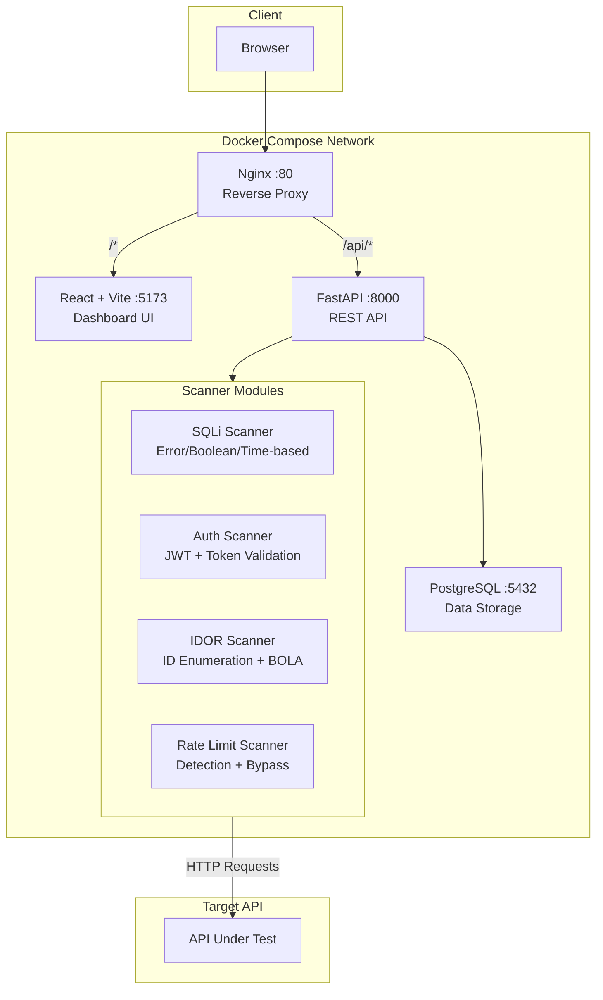

# API Security Scanner

[](https://github.com/adityasinh-jadeja/api-scanner/actions/workflows/ci.yml)
[](https://www.python.org/downloads/)
[](https://www.typescriptlang.org/)
[](https://fastapi.tiangolo.com/)
[](https://react.dev/)
[](LICENSE)
[](https://docs.docker.com/compose/)

> Full-stack API vulnerability scanner targeting the **OWASP API Security Top 10** with configurable scan modules and a React dashboard.

---

## Features

- **4 Security Scanner Modules** — SQL Injection, Authentication Bypass, IDOR/BOLA, and Rate Limiting
- **OWASP API Top 10 Coverage** — Maps directly to API1:2023 (BOLA), API2:2023 (Broken Auth), API4:2023 (Unrestricted Resource Consumption), and API8:2023 (Security Misconfiguration)
- **Real-time Scan Results** — Detailed vulnerability reports with severity levels, evidence collection, and remediation recommendations
- **JWT Authentication** — Secure user registration and login with bcrypt password hashing
- **Scan History** — Full audit trail of all scans with per-endpoint vulnerability breakdowns
- **React Dashboard** — Configure scans, select test modules, and review results in a modern UI
- **Dockerized** — One-command deployment with Docker Compose (PostgreSQL, FastAPI, React, Nginx)
- **Rate-Limited API** — Built-in rate limiting on all endpoints to prevent abuse

## Architecture



## Scanner Modules

| Module | OWASP Category | What It Tests |
|--------|---------------|---------------|
| **SQL Injection** | API8:2023 | Error-based, boolean-based blind, and time-based blind SQLi across MySQL, PostgreSQL, MSSQL, and Oracle |
| **Authentication** | API2:2023 | Missing auth checks, invalid token acceptance, JWT none-algorithm attacks, signature removal |
| **IDOR/BOLA** | API1:2023 | Sequential ID enumeration, UUID manipulation, missing authorization on object access |
| **Rate Limiting** | API4:2023 | Missing rate limits, header-only enforcement, IP spoofing bypass, endpoint variation bypass |

## Tech Stack

| Layer | Technology |
|-------|-----------|
| **Backend** | Python 3.13, FastAPI, SQLAlchemy, Pydantic, Alembic |
| **Frontend** | React 19, TypeScript 5.9, Vite, Zustand, React Query, Radix UI |
| **Database** | PostgreSQL 16 |
| **Security** | bcrypt, python-jose (JWT), slowapi (rate limiting) |
| **HTTP Clients** | httpx, aiohttp, requests |
| **Infrastructure** | Docker, Nginx, Gunicorn |
| **Code Quality** | Ruff, MyPy, Pylint, Biome, ESLint, Prettier |

## Quick Start

### Prerequisites

- [Docker](https://docs.docker.com/get-docker/) and [Docker Compose](https://docs.docker.com/compose/install/)

### 1. Clone and configure

```bash
git clone https://github.com/adityasinh-jadeja/api-scanner.git
cd api-scanner
cp .env.example .env
```

### 2. Start the development environment

```bash
docker compose -f dev.compose.yml up --build
```

### 3. Open the dashboard

Visit **http://localhost** — register an account and start scanning.

> **API Documentation:** FastAPI auto-generated docs are available at http://localhost:8000/docs

### Production

```bash
docker compose up --build -d
```

## API Endpoints

| Method | Endpoint | Description | Auth |
|--------|----------|-------------|------|
| `POST` | `/auth/register` | Register new user | No |
| `POST` | `/auth/login` | Login and receive JWT | No |
| `POST` | `/scans/` | Create and execute a scan | Yes |
| `GET` | `/scans/` | List user's scan history | Yes |
| `GET` | `/scans/{id}` | Get scan details with results | Yes |
| `DELETE` | `/scans/{id}` | Delete a scan | Yes |

## Project Structure

```
├── backend/                  # FastAPI backend
│   ├── core/                 # Database, security, dependencies
│   ├── models/               # SQLAlchemy models (User, Scan, TestResult)
│   ├── routes/               # API route handlers
│   ├── scanners/             # Security scanner modules
│   │   ├── base_scanner.py   # Abstract base with HTTP logic
│   │   ├── sqli_scanner.py   # SQL injection tests
│   │   ├── auth_scanner.py   # Authentication tests
│   │   ├── idor_scanner.py   # IDOR/BOLA tests
│   │   ├── rate_limit_scanner.py  # Rate limiting tests
│   │   └── payloads.py       # Attack payload definitions
│   ├── schemas/              # Pydantic validation schemas
│   ├── services/             # Business logic layer
│   └── repositories/         # Database query layer
├── frontend/                 # React + TypeScript frontend
│   └── src/
│       ├── components/       # Reusable UI components
│       ├── pages/            # Route pages (Dashboard, Results, Auth)
│       ├── hooks/            # Custom React hooks
│       ├── services/         # API service layer
│       ├── store/            # Zustand state management
│       └── types/            # TypeScript types + runtime guards
├── conf/                     # Configuration files
│   ├── docker/               # Dockerfiles (dev + prod)
│   └── nginx/                # Nginx configs (dev + prod)
├── compose.yml               # Production Docker Compose
├── dev.compose.yml           # Development Docker Compose
└── learn/                    # Project documentation and learning resources
```

## Configuration

All configuration is centralized in `.env`. Key settings:

| Variable | Default | Description |
|----------|---------|-------------|
| `SECRET_KEY` | — | JWT signing key (change in production) |
| `POSTGRES_USER` | `apiuser` | Database username |
| `POSTGRES_PASSWORD` | `apipass` | Database password |
| `DEFAULT_MAX_REQUESTS` | `100` | Max requests per scan |
| `SCANNER_RATE_LIMIT_THRESHOLD` | `100` | Scanner outgoing rate limit |
| `CORS_ORIGINS` | `localhost` | Allowed CORS origins |

## Disclaimer

This tool is intended for **authorized security testing only**. Always obtain proper authorization before scanning any API. Unauthorized scanning may violate laws and terms of service.

## License

[AGPL-3.0](LICENSE)
